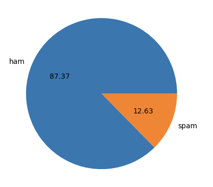
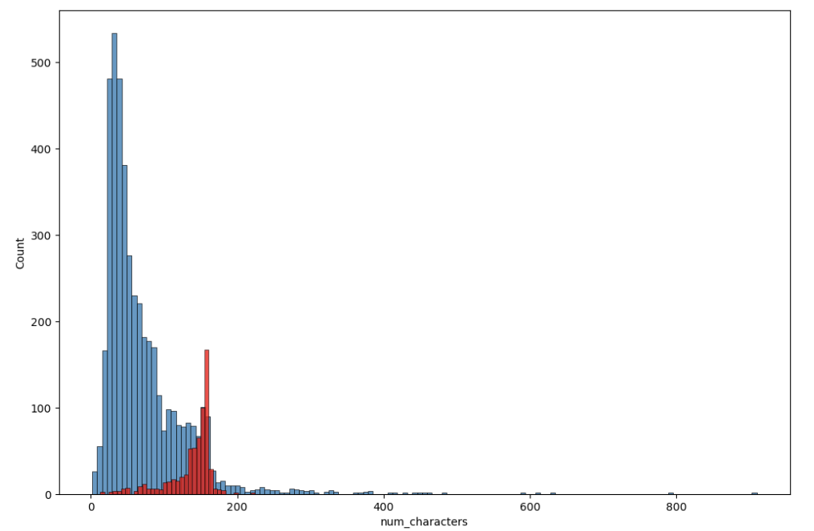
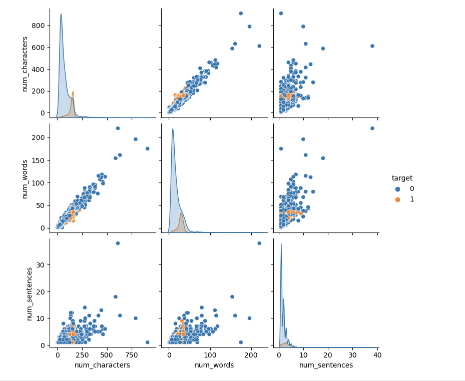
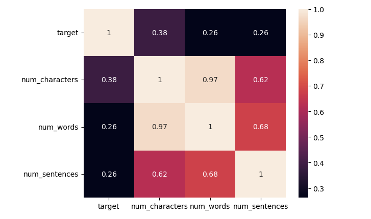
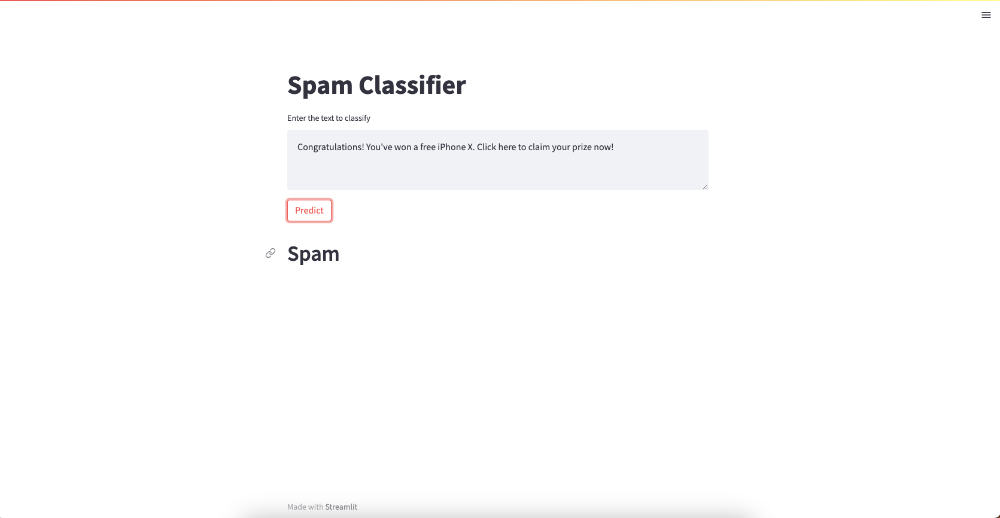
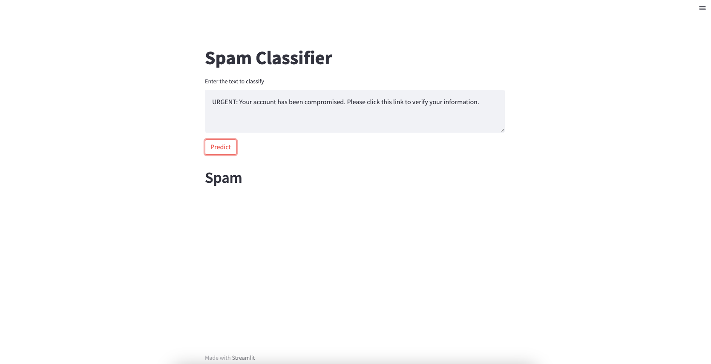
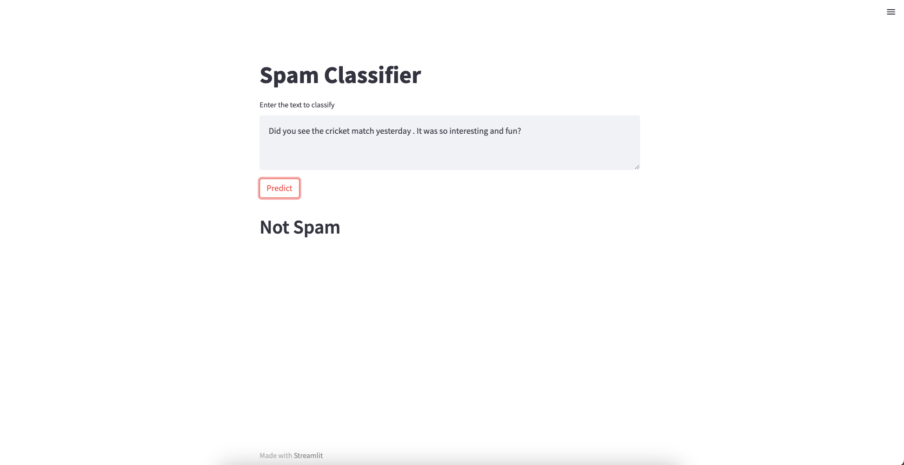

# SMS Spam Detection and Classification

This machine learning project aims to detect and classify SMS messages as either "ham" (legitimate) or "spam" using the SMS Spam Collection dataset from Kaggle.

## Table of Contents

1. [Introduction](#introduction)
2. [Project Overview](#project-overview)
3. [Data Cleaning](#data-cleaning)
4. [Exploratory Data Analysis (EDA)](#exploratory-data-analysis-eda)
5. [Text Preprocessing](#text-preprocessing)
6. [Model Building](#model-building)
7. [Evaluation](#evaluation)
8. [Improvement](#improvement)
9. [Conclusion](#conclusion)

## Introduction

Spam messages are a common problem in today's communication systems. Detecting and filtering out these unwanted messages is essential to provide a better user experience. In this project, we employ machine learning techniques to classify SMS messages as either spam or legitimate.
Dataset link kaggle: https://www.kaggle.com/datasets/uciml/sms-spam-collection-dataset

## Project Overview

### 1. Data Cleaning

We started by cleaning the dataset, including:

- Encoding labels using `LabelEncoder`.
- Handling missing values, if any.
- Removing duplicate entries.

### 2. Exploratory Data Analysis (EDA)

To gain insights into the dataset, we performed EDA:

- Analyzed the distribution of message lengths.
- Examined the distribution of characters, words, and sentences in each message.
- Visualized data using histograms, pair plots, and heatmaps.
- 
- 
- 
- 

### 3. Text Preprocessing

To prepare the text data for modeling, we applied the following preprocessing steps:

- Converted text to lowercase.
- Tokenized the messages.
- Removed special characters.
- Removed stop words and punctuation.
- Applied stemming to reduce words to their root forms.

### 4. Model Building

We experimented with various machine learning algorithms:

- Vectorized the preprocessed text data using the Bag of Words (BoW) approach.
- Explored different classifiers, including:
  - Gaussian Naive Bayes (GaussianNB)
  - Multinomial Naive Bayes (MultinomialNB)
  - Bernoulli Naive Bayes (BernoulliNB)
  - Logistic Regression
  - Support Vector Classifier (SVC)
  - Decision Tree Classifier
  - K-Nearest Neighbors (KNeighborsClassifier)
  - Random Forest Classifier
  - AdaBoost Classifier
  - Bagging Classifier
  - Extra Trees Classifier
  - Gradient Boosting Classifier
  - XGBoost Classifier

Multinomial Naive Bayes yielded the best accuracy and precision, so it was selected as the final model.

### 5. Evaluation

We evaluated the Multinomial Naive Bayes model using appropriate metrics such as accuracy, precision, recall, and F1-score. We also created a confusion matrix to visualize model performance.

### 6. Improvement

To enhance model performance, we experimented with the following techniques:

- Voting Classifier: Combining multiple models for better predictions.
- Stacking: Building an ensemble of models to improve accuracy.
- Scaling: Standardizing features to handle variations in data distribution.

## Conclusion

- 
- 
- 

This project successfully addresses the problem of SMS spam detection and classification. The Multinomial Naive Bayes model achieved the best results among the classifiers tested. Further improvements, such as fine-tuning hyperparameters and exploring deep learning approaches, could lead to even better performance.

Feel free to explore the code and documentation in this repository to gain a deeper understanding of the SMS spam detection process.

If you have any questions or suggestions, please don't hesitate to reach out.

Happy coding!
